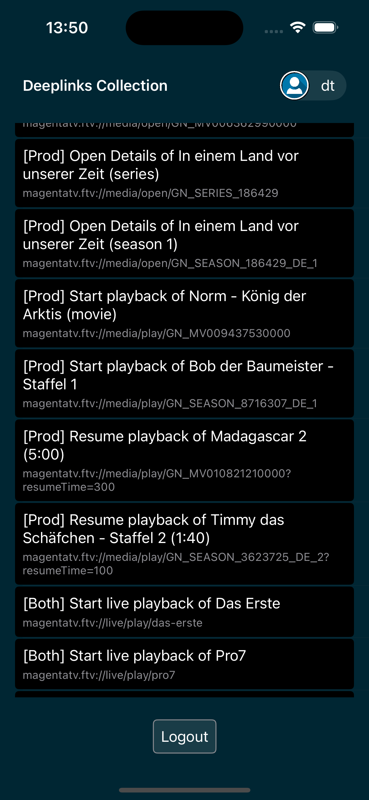
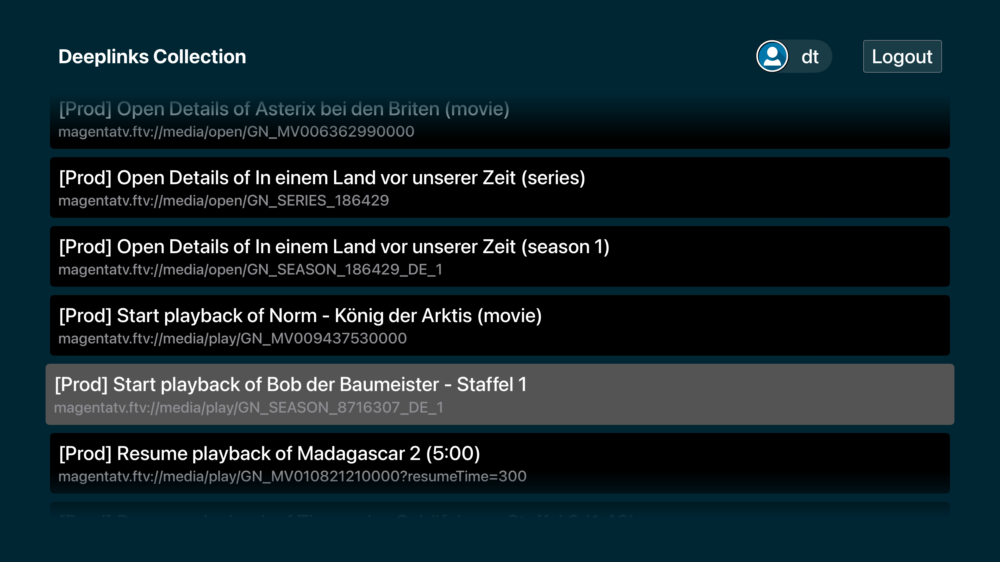

# Deeplinks Collection

Deeplinks Collection is a tester application build for iOS and tvOS written in SwiftUI.

The goal is to provide a convenient way for testing on how an app can handle deep links. The deep link collection is stored and fetched from a Firebase database and is presented on the screen so the user can easily test how the testable app can handle them. The database can store data for multiple apps, for each of them having associated credentials. By asking for the credentials associated with the testable app (e.g. Magenta TV), the tester app will provide only the relevant deep links to test.

## Dependencies

Google Firebase (https://github.com/firebase/firebase-ios-sdk).

### Screenshots

### 📱 iOS

### 🖥️ tvOS

### Testflight

The application is available in [TestFlight](https://testflight.apple.com/join/rjd5jhol).

## Contributions

* Geza Dezso <geza.dezso@accedo.tv>
* Alexandre Thomas <alexandre.thomas@accedo.tv>
